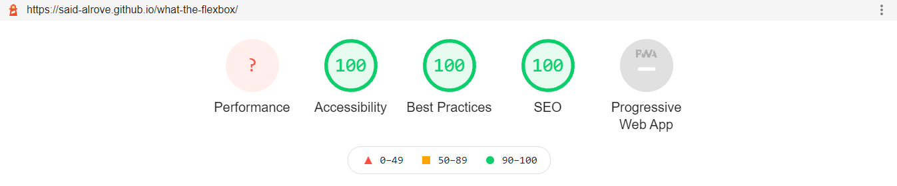

# [what-the-flexbox](https://said-alrove.github.io/what-the-flexbox/)
This was a project based on the practices given from the [What the Flexbox?](https://wesbos.com/) course taught by Wesbos on his [web](https://flexbox.io/).

## Table of contents
* [Preview](#preview)
* [What I learned](#what-i-learned)
* [Reports]
    - [Lighthouse](#lighthouse)
* [Open Graph](#open-graph)
    - [Facebook](#facebook)
    - [Twitter](#twitter)

## Preview


## What I learned

Well, certainly this was an interesting project due to it's the first time I have had such a great opportunity to use a SASS architecture.

> I used the **7-1 pattern** with this project due to I had already practiced enough with the **SMACSS** architecture to feel confident enough with it.

I'd like to mention a few things that I figured out while researching more information about the patterns/architectures for SASS projects:

* I had thought that the **theme** folder was assigned to the SASS members of the project such as variables, mixins, extends, etc., and yeah, in theory it is, at least for the variables, but not the **main variables**, instead, there should be declared the variables assigned for a **dark theme** or something related that will override the main variables if necessary.
    -  Therefore, the main variables, mixins, and/or extends should be included within the **abstracts** folder in the 7-1 pattern, and in the **base** folder if it's that you're using the SMACSS architecture.
    - The way how I organized the different variables, mixins, and extends was by modularizing them into different [partials](https://sass-lang.com/documentation/at-rules/use#partials) and then importing them into a main one (the one that I'd call in the main file of the project).
    - To have a better understanding of where a mixin belongs to (if it's from me or from a third-party vendor) I used the @use at-rule to import the main file of the SASS members with the prefix **abs** (due to the name of the folder **abstracts**), and the third-party vendors (that should be located in the **vendors** folder) with a prefix that identifies them (for instance, I used the prefix **less** for [lessier](https://github.com/said-alrove/mixins-sass) which is a mixins library created by me).
* I also had some misunderstanding with the **components** and **layout** folders in the 7-1 pattern (or **module** and **layout** folders in SMACSS) due to I thought that **module** (in the case of SMACSS) was specifically for utilities, which is wrong due to the correct place for that is in its own partial (called helpers) in the base folder, and with respect to the **components** and **layout** folders, I had not clear the difference between them, but thanks to the research I could clarify that point.
    - The **layout** folder is specifically dedicated to major components that allow the page to have a structured layout (such as headers, navs, footers, etc.).
    - The **components** folder is dedicated, in contrast ... to small components with high reusability (such as cards, buttons, loaders, etc.).
* Now, I mentioned that the elements inside the **components** folder should have high reusability, well, obviously there'll be things that you won't use more than once and that'll be located just on a specific page, and luckily there's a specific folder where to put those elements, that's called **pages** (this is for the 7-1 pattern), due to I didn't find too much information about it yet what I did was to create an individual partial for each page that I have in the project, and in there put all the components that weren't goint to be reused in other pages.
* Also, something that I was having trouble with was the importation of the partials into the main file of the project, I had the idea that we shouldn't use @import in SASS due to is kind of deprecated, therefore I was using the @use at-rule only, but I was wrong. The situation where we shouldn't be using the @import at-rule is when importing SASS members because they're declared "globally", thus it's difficult to know where a variable, mixin, or extend comes from (what import makes is to print all the stuff that's in the file that's been imported as if they'd be declared in the same file from where you're importing it) because we can't use prefixes with it (we can, but we should write them directly in the member's names which isn't practical). But we can (and we must to) use it when importing partials that contain style rules, into the main file.
    - The reason why we shouldn't bring the variables, and all that other stuff with the @import at-rule is because how I mentioned before, you can't give it a prefix when importing it, therefore in those cases, what you should do is to use the @use at-rule which allows you not only to import SASS members with a prefix but also to modify variables that are declared in the file you're importing **while importing it!** with the [with](https://sass-lang.com/documentation/at-rules/use#configuration) keyword (this means that you don't have to go to the main file and change the variable's value, you can "overwrite it without affecting the original value" instead).
    - Furthermore, thanks to the fact that we imported the styles into the main file, we can access the members we imported previously from the partials without having to call the members again and again on each file (this is because how I mentioned, import prints all the styles from the partial you're importing as if they were declared originally in the file from where you're importing it).
* Something cool I have to add with respect to the @import at-rule is that you can import several files without having to write the rule again and again just by puttin a comma at the end of each file's name you're importing (this isn't possible with @use).
> Here are a couple of screenshots to illustrate in a better way everything I'm talking about:
.png);
.png);
* Now, with respect to new things I learned ... I was reading about the [pseudo-clases](https://developer.mozilla.org/en-US/docs/Web/CSS/Pseudo-classes) and something that was useful in a specific part of the project, was the use of the keywords **even** and **odd** when using the pseudo-classes **nth-child**.
    > **Even** represents elements whose numeric position in a series of siblings is odd: 1, 3, 5, etc.
    > **Odd** represents elements whose numeric position in a series of siblings is even: 2, 4, 6, etc.
* I'd like to comment that I had some troubles when trying to scale the project with the classes' names using BEM, this was due to there were some components that I reused more than once in the project (e.g. the navigation) but that had some variations in specific pages, therefore, what should I do?, add a **modifier** obviously ... but, should I be naming it at the end with the name of the page where's located? or with a word that describes the behavior that makes it different from the navigation block?.
    - My conclusions are that I should name the modifier with something that describes the behavior that makes the component different from the normal block. In that case, in order to don't overwrite too much code, I should generalize even more the styles for the block (due to in the navigation, I had specified styles with a breakpoint that I only used in that main navigation, which made me more difficult the task of reuse it). I'll modify the project by adding everything I've mentioned and I'll actualize this part of the section.
    > The task is already done! ✅
    - Something cool about working with large projects is that due to I find problems with respect to the scalability, I can understand in better way methodologies like BEM, and I'm able to test different things in order to be more confident about how to maintain a project on a large scale.
* As one more thing I'd like to mention is that I looked for information about the **preload**, **prefetch**, **prerender**, and **preconnect** values for the [link](https://developer.mozilla.org/en-US/docs/Web/HTML/Element/link) attribute and their relationship with the page performance. My conclusions are the following:
    - There are two important values when using third-party vendors, **dns-prefetch**, and **preconnect**, what they do basically is to do the proccess of looking for the IP of the domain that you're trying to communicate with before the browser needs it (that way the proccess of downloading of a resource from a cross origin is faster because the connection with the **DNS server** has already been done).
    - Now, the difference between them is that **dns-prefetch** only does what I mentioned above, **preconnect** goes beyond because it plus does the TLS negotiation and all that stuff that happens when trying to connect with a server (the server of the page you're trying to communicate with, not the **DNS servser**). If you want more information you can check [this video](https://www.youtube.com/watch?v=T5ERzSRNaKw&ab_channel=AntonioSarosi) (it's in Spanish), but shorting it, preconnect does the full process of connecting with the server before the browser needs it which give us a better performance.
    - **Preload** allows us to say to the browser that it should load specific files with a high priority, we can use the **type** attribute to specify to it what kind of file is trying to download (to see if it supports it) and that way have an even better performance.
    - **Prefetch** is something similar to preload but with low priority, this should be used for loading resources that the user might need in the future (when going to another page), here we can also use the **type** attribute.
    - **Prerender** at the beginning was used for rendering pages that the user might need in the future (similar to prefetch, but instead of pre-caching a file that other page might need, it renders the full page with all the assets it needs), but because this could provoke problems in the bandwidth of the users when rendering a full page in the background, Google changed the behavior of it, and now what it does is basically similar to **prefetch**, but it prefetches the assets the page will need in the cache without executing them (e.g. Js files) instead of just prefetching specific files.
* Something importat to mention too is that when preconnecting cross origin servers, we should use the **crossorigin** attribute, the value of it could be either **anonymous** or **use-credentials** (If you're not working with Js or things where you might use cookies, you'll just need to declare "anonymous"). Due to anonymous is the default value, you can give the value's attribute empty, or just declare the attribute as a boolean (if it's declared is true, if not, is false), for example:
```
    <link rel="preconnect" href="https://fonts.gstatic.com" crossorigin="">
```
Or: 
```
    <link rel="preconnect" href="https://fonts.gstatic.com" crossorigin>
```
    - If you'd like to know where all this information come from, check these articles:
        - [Link types: preload](https://developer.mozilla.org/en-US/docs/Web/HTML/Link_types/preload)
        - [Preload, Prefetch and Preconnect: Speed Up your Website with Resource Hints](https://blog.dareboost.com/en/2020/05/preload-prefetch-preconnect-resource-hints/)
        - [Prefetching, preloading and prebrowsing](https://css-tricks.com/prefetching-preloading-prebrowsing/)
        - [Cross-Origin Resource Sharing (CORS)](https://developer.mozilla.org/en-US/docs/Web/HTTP/CORS)
        - [HTML attribute: crossorigin](https://developer.mozilla.org/en-US/docs/Web/HTML/Attributes/crossorigin)
        - [Introducing NoState prefetch](https://developers.google.com/web/updates/2018/07/nostate-prefetch)
* Now, earlier in this section I mentioned that I used the 7-1 pattern for this project and that I already felt confident with SMACSS, something I'd like to comment is that obviously, the kind of structure these patterns/architectures offer is not something we should follow literally, we should take the things that we might use the most according to our needs, and remove those that we won't use, right now I'm just practicing with the architectures that are already designed, but in future projects, once I know the most popular (7-1, SMACSS, and ITCSS) I'll start making combinations according to what I need the most. 

* Something else I forgot to mention was that in the Lighthouse report I saw some issues with respect to the links to my social media, it was basically that when using anchor elements with the **_blank** target's value, we should use the **rel** attribute with the value **noreferer** or **noopener** because that way we can avoid problems with respect to our page performance (the other page may run on the same process like ours, and if that page runs a lot of Javascript, the performance of our page will be affected). For more information [check this out](https://web.dev/external-anchors-use-rel-noopener/?utm_source=lighthouse&utm_medium=lr).

* One thing that was also important with respect to the performance was the order in how I put the links in the head of the document, according to what I read, the browser obviously starts rendering the HTML file from top to bottom, therefore the hierarchy matters, we should put the preload and preconnect links first, and then stuff that might be less important, and so on.

## Reports

> In this section I was planning to take screenshots to the **Lighthouse** and **Gtmetrix** reports for a full understanding of the page's quality, but due to I had problems with respect to the reports for things that I unknown I'll just add the Lighthouse report for now.

### Lighthouse


> **Disclaimer**: The lighthouse report showed me a error with respect to the performance metric but I'm not completaly sure about what happened that provoked it yet.

## Open Graph

### Facebook


### Twitter
