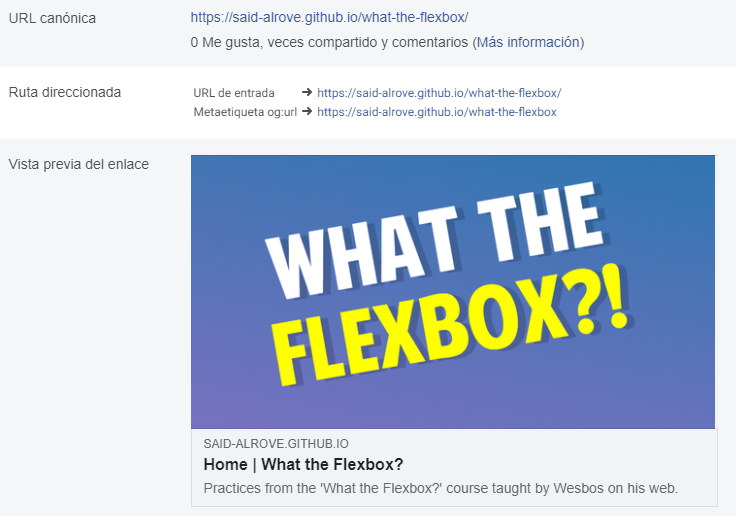
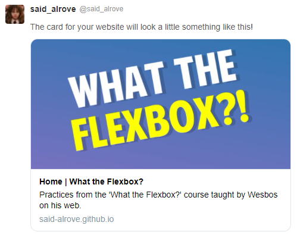

# [easy-recipe](https://said-alrove.github.io/easy-recipe/)
This was a project based on the practices given from the [What the Flexbox?](https://wesbos.com/) course taught by Wesbos on his [web](https://flexbox.io/).

## Project's preview

## What I learned

### Lighthouse

### Facebook

### Twitter
